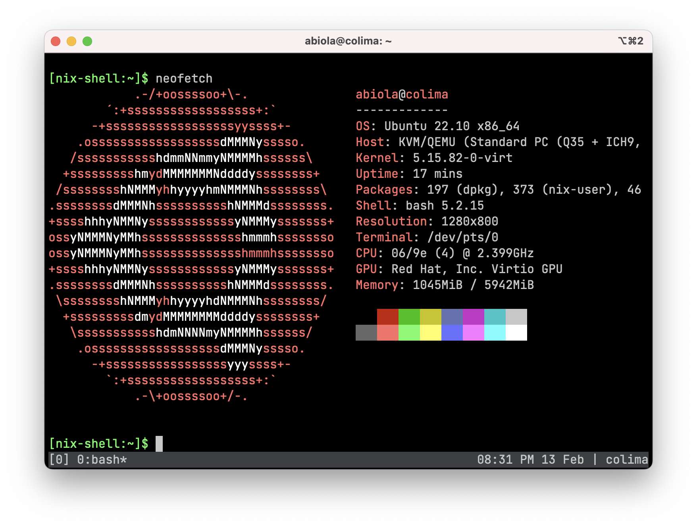

dotfiles
========

Dotfiles managed with Stow for Nix or Brew



## Nix

### Prerequisite

Install Nix.

**NOTE:** Nix must be installed in multi-user mode.

```sh
export NIX_VERSION=2.15.0
sh <(curl -L https://releases.nixos.org/nix/nix-${NIX_VERSION}/install) --daemon
```

### Installation

`cd` into repository and setup dotfiles

```
nix --experimental-features 'nix-command flakes' run nixpkgs#stow \
    aerc bat bin git ideavim neovim nix tmux zsh
```

Install packages.

```
nix profile install path:$HOME/.config/nix/
```

### Declarative Nix packages

```sh
# create a copy of sample packages file
cp ~/.config/nix/packages.sample.nix ~/.config/nix/packages.nix

# edit packages file to add extra packages
vim ~/.config/nix/packages.nix

# run the `nix-switch` alias
nix-switch
```

## Brew

### Prerequisite

Homebrew

```sh
/bin/bash -c "$(curl -fsSL https://raw.githubusercontent.com/Homebrew/install/HEAD/install.sh)"
```

### Installation

Install Stow

```
brew install stow
```

Setup dotfiles

```
stow aerc bat brew bin git ideavim neovim tmux zsh
```

Install packages

```
brew bundle -v --file ~/.config/brew/Brewfile
```

### Declarative Brew packages

```sh
# edit ~/.config/brew/packages.rb to add extra packages
# run the brew-switch alias
brew-switch
```

