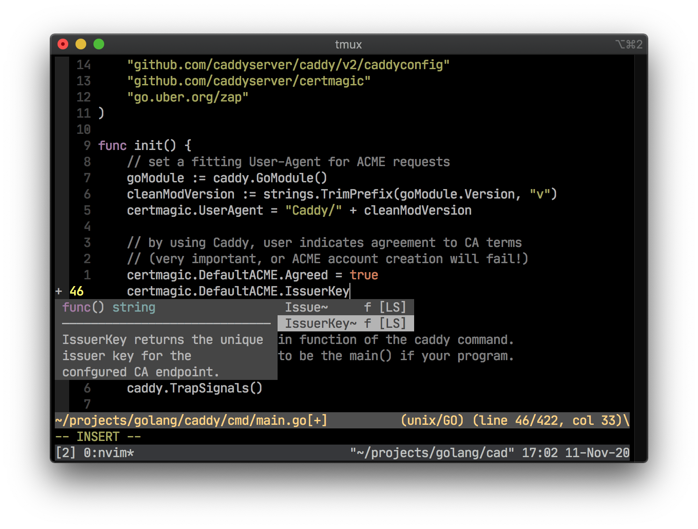

dotfiles
========

Dotfiles managed with Nix and Stow



## Prerequisite

Nix

```sh
sh <(curl -L https://nixos.org/nix/install)
```

## Installation

Install Stow

```
nix-env -iA nixpkgs.stow
```

Setup dotfiles

```
stow bat bin git nix tmux neovim zsh ideavim
```

Install packages

```
nix-env -if ~/.packages.nix
```

## Modifying declarative Nix packages

**NOTE**: only works in multi-user mode, running `nix-env -irf ...` in single user mode would remove and break `nix`.

```sh
# edit ~/.packages.nix
nix-env -irf ~/.packages.nix
```

## Why not Home-Manager since this is based Nix?

After wasting tangible time battling with errors like the following,
I chose to dump Home-Manager and manage dotfiles normally i.e. via the config files.

```console
building '/nix/store/v0ga03g14dvqrw1qmq2accrd5g6j1fvl-user-environment.drv'...
error: files '/nix/store/9qxkblnxyizg5fbq0g1g53r02fl9nqch-home-manager-path/share/zsh/site-functions/_nix' and '/nix/store/6qw3r57nra08ars8j8zyj3fl8lz4cvnd-nix-2.10.3/share/zsh/site-functions/_nix' have the same priority 5; use 'nix-env --set-flag priority NUMBER INSTALLED_PKGNAME' or type 'nix profile install --help' if using 'nix profile' to find out howto change the priority of one of the conflicting packages (0 being the highest priority)
error: builder for '/nix/store/v0ga03g14dvqrw1qmq2accrd5g6j1fvl-user-environment.drv' failed with exit code 1
```

I am fond of reproducing my dev setup (usually in virtual machines) and intermittently facing obscure errors makes Home-Manager unappealing.
