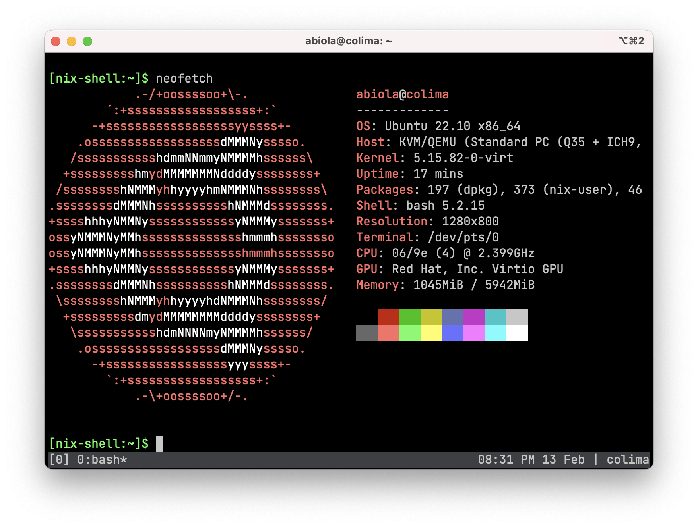

dotfiles
========

Dotfiles managed with Stow for Brew (or Apt)



## Brew

### Prerequisite

Homebrew

```sh
/bin/bash -c "$(curl -fsSL https://raw.githubusercontent.com/Homebrew/install/HEAD/install.sh)"
```

### Installation

Install Stow

```
brew install stow
```

Setup dotfiles

```
stow bat brew bin git neovim tmux zsh
```

Install packages

```
brew bundle -v --file ~/.config/brew/Brewfile
```

### Declarative Brew packages

```sh
# create a copy of the sample packages file
cp ~/.config/brew/packages.sample.rb ~/.config/brew/packages.rb

# edit packages file to add extra packages
vim ~/.config/brew/packages.rb

# run the `brew-switch` alias
brew-switch
```

## Apt (Ubuntu/Debian)

Install Stow

```
sudo apt install stow
```

Setup dotfiles

```
stow apt bat bin git neovim tmux zsh
```

Install packages

```sh
bash ~/.config/my-apt/core.sh
```

### Additional Packages

```sh
# create a copy of the sample packages file
cp ~/.config/my-apt/packages.sample.sh ~/.config/my-apt/packages.sh

# edit packages file to add extra packages
vim ~/.config/my-apt/packages.sh

# run the `apt-switch` alias
apt-switch
```
